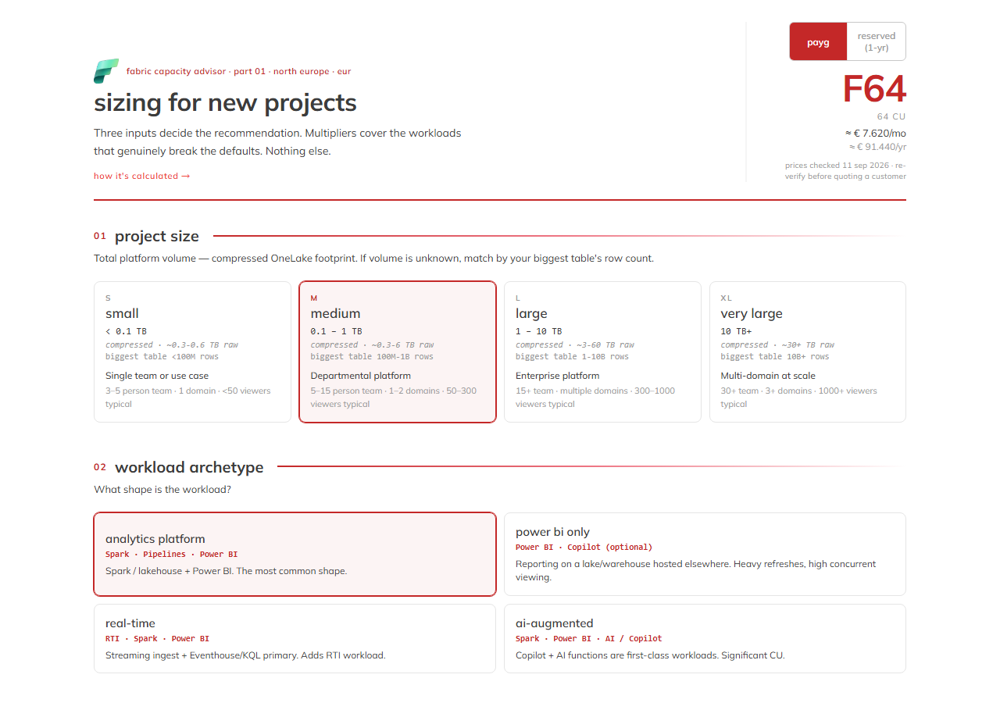
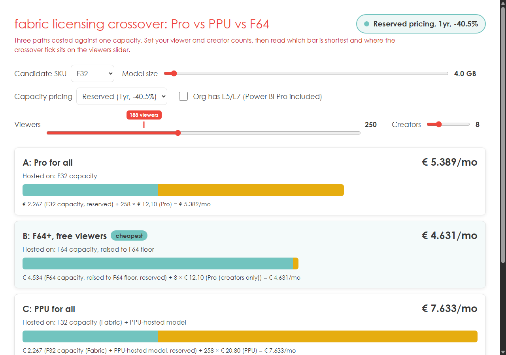
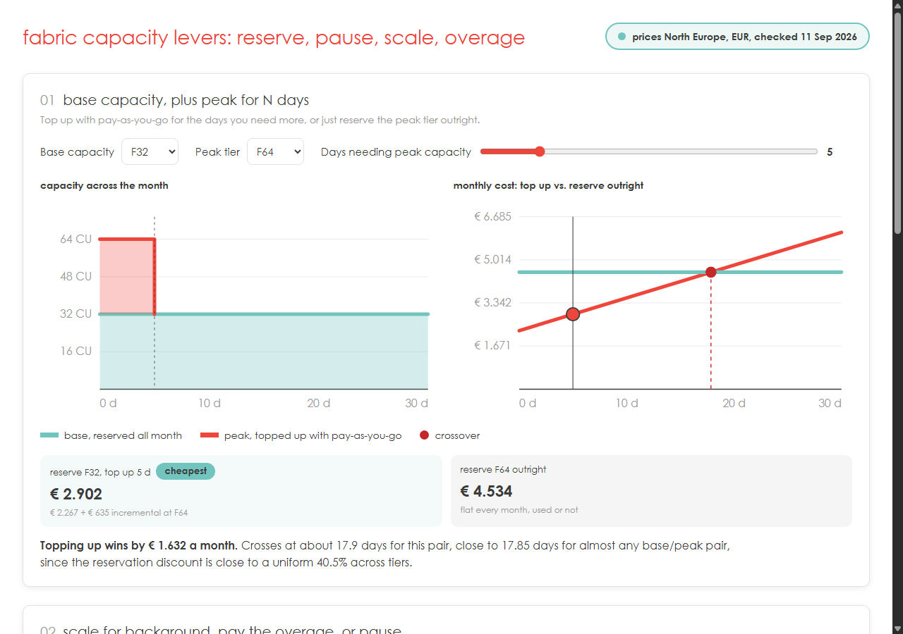

# Fabric capacity strategies — interactive tools

Standalone, dependency-light HTML tools built alongside "The ultimate decision guide:
capacity strategies to optimise cost and compute" (delaware, FabCon Barcelona / dataMinds
Mechelen 2026). Take them home from the talk, or use them cold — each one opens straight in
a browser, no build step, no install, no server, no tracking.

## The tools

### [Fabric Capacity Advisor](CapacityAdvisor/)

Sizes a new Fabric project end to end and recommends an F-SKU, with a full licensing and
total-cost-of-ownership breakdown. No build step, no install, works offline — open
`CapacityAdvisor/CapacityAdvisor.html` in a browser.

→ [Full details](CapacityAdvisor/README.md)

### [Licensing crossover: Pro vs PPU vs F64](licensing-crossover/)

Costs three Power BI licensing strategies side by side for a given workload and finds the
viewer count where the cheapest option changes. No build step, no install, works offline —
open `licensing-crossover/licensing-crossover.html` in a browser.

→ [Full details](licensing-crossover/README.md)

### [Capacity levers: reserve, pause, scale, overage](capacity-levers/)

Costs three Fabric capacity scaling decisions side by side — pay-as-you-go vs. reserving a
peak tier, scaling vs. pausing a background burst, scaling vs. paying the overage on an
interactive burst — and shows where each crossover sits. No build step, no install, works
offline — open `capacity-levers/capacity-levers.html` in a browser.

→ [Full details](capacity-levers/README.md)

## Talks

Slide decks from the conference and community talks these tools were built for.

→ [Full list](talks/)

## Attribution

Built by Frederik Declerck for "The ultimate decision guide: capacity strategies to
optimise cost and compute" (delaware, FabCon Barcelona / dataMinds Mechelen 2026). Not
official Microsoft guidance or a live pricing tool — each tool's own footer carries the
full disclaimer and a link to [delaware's Microsoft Fabric
work](https://www.delaware.pro/en-be/solutions/microsoft/microsoft-fabric).
